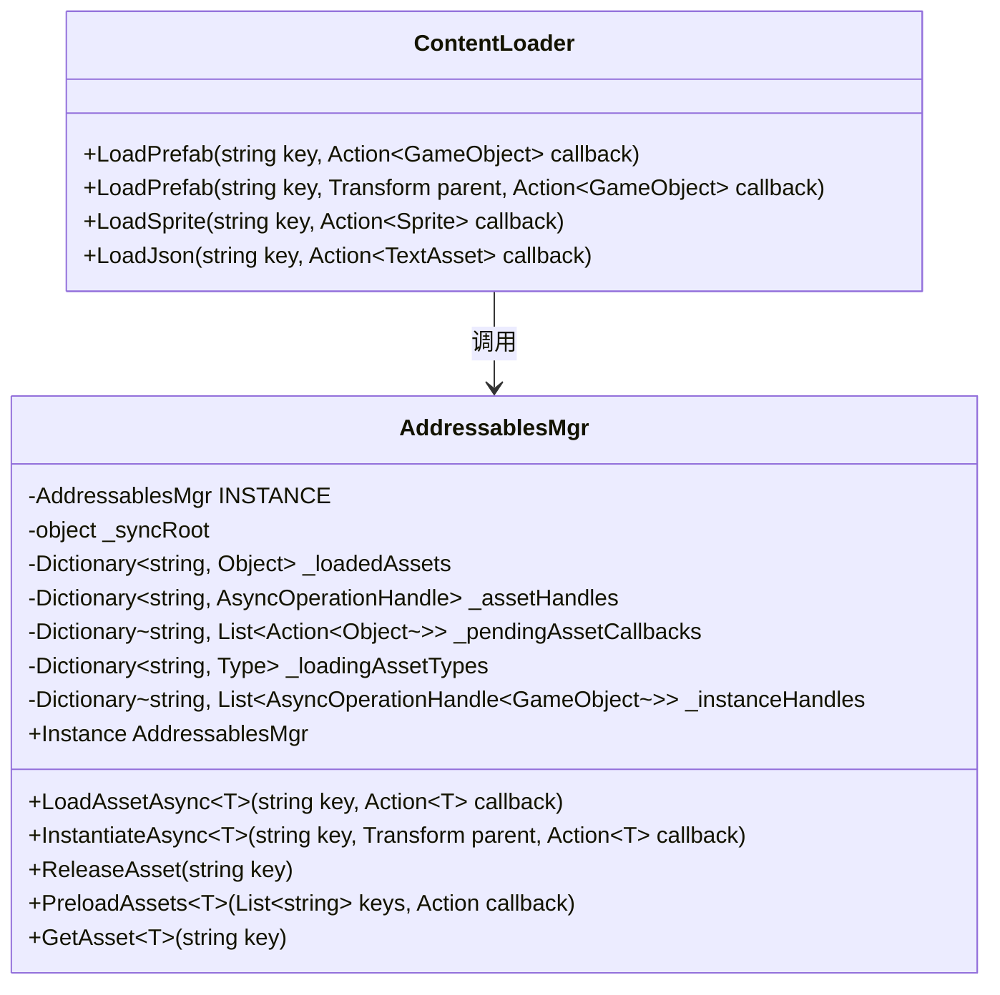
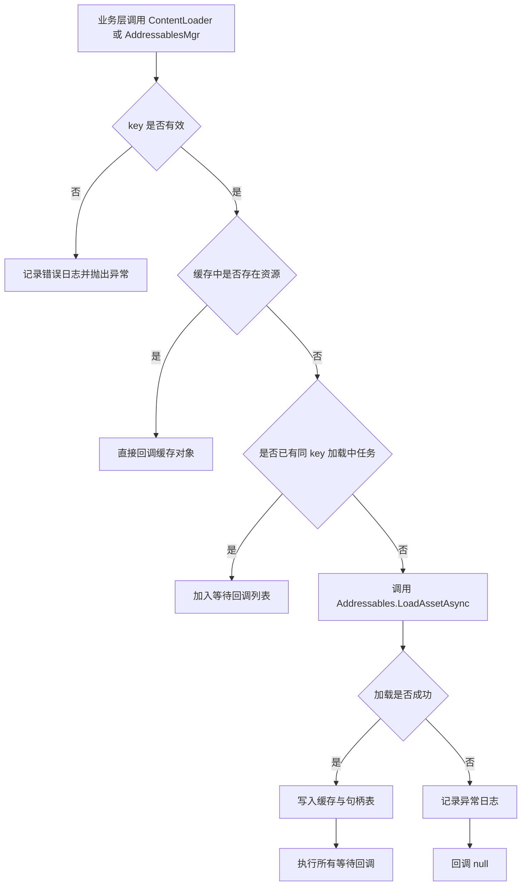
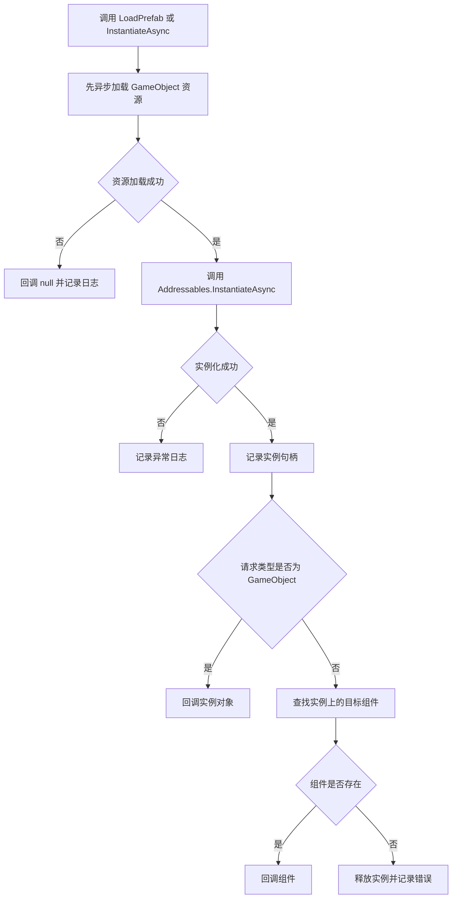
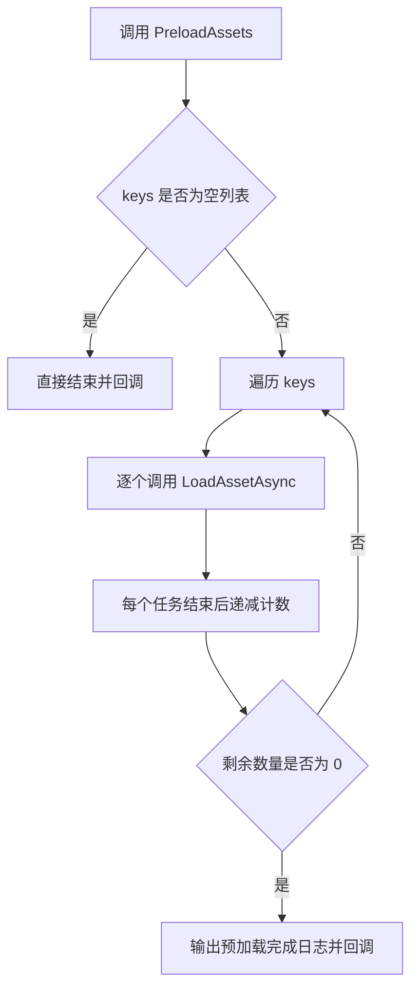

# Addressables 资源加载管理开发文档

## 1. 文档概述

本文档描述 `ShanHaiFantasy` 项目中 Addressables 资源加载管理模块的设计与使用方式，面向开发、策划以及后续 AI 内容接入场景。

模块目录：

- `Assets/Script/GamePlay/AddressablesMgr/AddressablesMgr.cs`
- `Assets/Script/GamePlay/AddressablesMgr/ContentLoader.cs`

模块目标：

- 提供统一的 Addressables 资源访问入口
- 支持 Prefab、Sprite、JSON 等资源的异步加载
- 支持资源缓存、Prefab 实例化、资源释放与批量预加载
- 兼容 AI 生成内容的动态加载与版本管理

---

## 2. 类图



类职责说明：

- `AddressablesMgr`
  负责底层资源异步加载、缓存复用、实例句柄管理、释放与预加载。
- `ContentLoader`
  负责对业务层提供简洁入口，避免系统直接耦合 `Addressables` API。

---

## 3. 核心接口说明

### 3.1 AddressablesMgr

| 接口 | 参数 | 返回值 | 功能说明 | 使用限制 |
| --- | --- | --- | --- | --- |
| `LoadAssetAsync<T>(string key, Action<T> callback)` | `key`：资源 Key；`callback`：回调 | 无 | 异步加载资源，命中缓存时直接回调缓存对象 | `key` 不能为空；同一 `key` 并发加载时类型必须一致 |
| `InstantiateAsync<T>(string key, Transform parent, Action<T> callback)` | `key`：Prefab Key；`parent`：父节点；`callback`：回调 | 无 | 异步实例化 Prefab，支持返回 `GameObject` 或组件 | 建议使用唯一 Prefab Key，不建议用非唯一 Label 做实例化 |
| `ReleaseAsset(string key)` | `key`：资源 Key | 无 | 释放该 Key 的缓存资源及所有已记录实例 | 仅释放通过本管理器记录的句柄 |
| `PreloadAssets<T>(List<string> keys, Action callback)` | `keys`：预加载列表；`callback`：结束回调 | 无 | 批量预加载资源，全部处理完成后统一通知 | `keys` 不能为 `null` |
| `GetAsset<T>(string key)` | `key`：资源 Key | `T` | 从缓存中读取已加载资源 | 仅返回已缓存对象，不会触发加载 |

### 3.2 ContentLoader

| 接口 | 参数 | 返回值 | 功能说明 | 使用限制 |
| --- | --- | --- | --- | --- |
| `LoadPrefab(string key, Action<GameObject> callback)` | `key`、`callback` | 无 | 加载并实例化 Prefab | 默认无父节点 |
| `LoadPrefab(string key, Transform parent, Action<GameObject> callback)` | `key`、`parent`、`callback` | 无 | 加载并实例化 Prefab，并挂到指定父节点下 | `parent` 可为空 |
| `LoadSprite(string key, Action<Sprite> callback)` | `key`、`callback` | 无 | 加载 Sprite 资源 | 仅做资源加载，不做显示绑定 |
| `LoadJson(string key, Action<TextAsset> callback)` | `key`、`callback` | 无 | 加载 JSON 文本资源 | 建议配合版本化 Key 使用 |

---

## 4. 功能与资源流程图

### 4.1 资源异步加载流程



### 4.2 Prefab 实例化流程



### 4.3 批量预加载流程



---

## 5. 调用示例

### 5.1 加载并实例化 Prefab

```csharp
using UnityEngine;

public class DemoPrefabLoader : MonoBehaviour {
    [SerializeField] private Transform root;

    public void LoadEnemy() {
        ContentLoader.LoadPrefab("enemy_wolf__v1", root, (go) => {
            if (go == null) {
                Debug.LogError("Prefab 加载失败");
                return;
            }

            Debug.Log("Prefab 加载完成: " + go.name);
        });
    }
}
```

### 5.2 加载 Sprite

```csharp
ContentLoader.LoadSprite("ui_icon_skill_fire__v1", (sprite) => {
    if (sprite == null) {
        Debug.LogError("Sprite 加载失败");
        return;
    }

    Debug.Log("Sprite 加载完成: " + sprite.name);
});
```

### 5.3 加载 JSON

```csharp
ContentLoader.LoadJson("quest_side_001__v1", (json) => {
    if (json == null) {
        Debug.LogError("JSON 加载失败");
        return;
    }

    Debug.Log("JSON 加载完成: " + json.text);
});
```

### 5.4 批量预加载

```csharp
using System.Collections.Generic;
using UnityEngine;

public class DemoPreload {
    public void PreloadUiAssets() {
        AddressablesMgr.Instance.PreloadAssets<GameObject>(
            new List<string> { "panel_inventory__v1", "panel_role__v1" },
            () => {
                Debug.Log("批量预加载完成");
            }
        );
    }
}
```

### 5.5 释放资源

```csharp
AddressablesMgr.Instance.ReleaseAsset("enemy_wolf__v1");
```

---

## 6. 异常处理说明

| 异常类型 | 触发条件 | 表现形式 | 处理方式 |
| --- | --- | --- | --- |
| `ArgumentException` | `key` 为空、空字符串或全空白 | 记录错误日志并抛出异常 | 调用前校验 key，禁止传空 |
| `ArgumentNullException` | `PreloadAssets` 的 `keys` 为 `null` | 记录错误日志并抛出异常 | 调用前保证列表已初始化 |
| `InvalidOperationException` | 同一 key 在并发加载时使用了不同资源类型 | 抛出异常 | 同一个 key 的加载类型保持一致 |
| `InvalidOperationException` | Addressables 加载失败 | 记录异常日志，回调 `null` | 检查 Addressables 配置、Key、Group 与打包结果 |
| `InvalidCastException` | 缓存中资源类型与请求类型不一致 | 抛出异常 | 统一 key 的资源类型定义，避免混用 |

失败处理策略：

- 所有关键失败路径都会输出日志，方便在 Unity Console 中定位问题。
- 加载失败时不会把错误对象写入缓存。
- 实例化阶段如果找不到请求组件，会立即释放已创建实例，避免脏对象残留。

---

## 7. 与 AI 内容或其他模块集成说明

### 7.1 Key/ID 管理约定

建议所有可动态更新资源使用统一格式：

```text
artifact_id__version
```

示例：

- `quest_side_001__v1`
- `npc_dialogue_1001__v2`
- `ui_icon_skill_fire__v1`

设计意义：

- `artifact_id` 用于标识内容实体
- `version` 用于区分 AI 重生成版本或人工修订版本
- 便于和内容审核流、发布流、回滚流做映射

### 7.2 与 AI 内容工作流的关系

建议将 AI 内容与资源目录对应起来：

- `Assets/ToBundle/Json/`
  存放 AI 生成任务、对话、敌人配置等 JSON
- `Assets/ToBundle/Prefabs/`
  存放 AI 输出后经人工整理的可加载 Prefab
- `Assets/Content/Generated/`
  存放待审核的 AI 内容原稿
- `Assets/Content/Reviewed/`、`Assets/Content/Published/`
  存放审核后内容与正式发布内容

推荐流程：

1. AI 生成内容草稿并产出版本号
2. 内容导入 `ToBundle` 对应目录
3. 配置 Addressables Key 与 Label
4. 业务层通过 `ContentLoader` 或 `AddressablesMgr` 统一加载
5. 发布新版本时通过新的 `version` Key 切换资源

### 7.3 与其他模块的集成方式

- UI 模块
  可使用 `LoadPrefab` 加载 Panel、Popup 预制件
- QuestSystem / DialogueSystem
  可使用 `LoadJson` 加载任务与对话数据
- CombatSystem
  可使用 `LoadPrefab` 与 `LoadSprite` 加载敌人表现资源

---

## 8. 目录与资源映射说明

### 8.1 模块代码目录

当前模块代码位于：

- `Assets/Script/GamePlay/AddressablesMgr/`

### 8.2 推荐资源目录映射

| 资源类型 | 建议目录 | Key 示例 | Label 建议 |
| --- | --- | --- | --- |
| 角色/敌人 Prefab | `Assets/ToBundle/Prefabs/Characters/` `Assets/ToBundle/Prefabs/Enemies/` | `enemy_wolf__v1` | `prefab`, `enemy`, `v1` |
| UI Prefab | `Assets/ToBundle/UI/Panels/` `Assets/ToBundle/UI/Popups/` | `panel_inventory__v1` | `ui`, `panel`, `v1` |
| Sprite | `Assets/ToBundle/Sprites/` | `ui_icon_skill_fire__v1` | `sprite`, `ui`, `v1` |
| JSON | `Assets/ToBundle/Json/` | `quest_side_001__v1` | `json`, `quest`, `v1` |

### 8.3 分组策略建议

- 按资源类型分组
  例如 `Prefabs`、`UI`、`Sprites`、`Json`
- 按内容来源分组
  例如 `Manual`、`AI_Generated`
- 按版本或发布阶段使用 Label
  例如 `v1`、`v2`、`reviewed`、`published`

说明：

- `LoadAssetAsync` 可接受 key 或 label，但业务层推荐优先使用唯一 key。
- `InstantiateAsync` 用于实例化时，推荐传入唯一的 Prefab Key，避免 Label 指向多个资源时产生歧义。

---

## 9. 内存管理与缓存策略

### 9.1 缓存策略

- `_loadedAssets`
  缓存已经成功加载的资源对象
- `_assetHandles`
  缓存资源加载句柄，供释放使用
- `_instanceHandles`
  缓存通过 `InstantiateAsync` 创建的实例句柄列表

收益：

- 避免同一资源重复加载
- 支持按 key 统一释放资源和实例
- 减少频繁加载造成的性能波动

### 9.2 释放策略

- 对普通资源调用 `Addressables.Release`
- 对实例对象调用 `Addressables.ReleaseInstance`
- `ReleaseAsset(key)` 会同时尝试释放该 key 的缓存资源和所有已登记实例

最佳实践：

- 场景退出、系统关闭、UI 关闭时及时释放不再使用的 key
- 对频繁打开的 UI 或高频资源，可结合缓存策略延迟释放
- 对大体积资源避免长期驻留，防止内存上涨

---

## 10. 线程安全说明

模块内部使用 `_syncRoot` 对以下共享数据结构进行保护：

- `_loadedAssets`
- `_assetHandles`
- `_pendingAssetCallbacks`
- `_loadingAssetTypes`
- `_instanceHandles`

线程安全目标：

- 防止同一 key 被重复发起多个底层加载
- 保证并发回调注册时不会破坏内部字典状态
- 保证缓存写入和释放逻辑一致

使用注意：

- Addressables 的完成回调通常在 Unity 主线程上下文中消费更安全。
- 业务层回调中若要访问 Unity 对象，应继续遵守 Unity 主线程限制。
- 不要在回调中做阻塞型长耗时逻辑，避免卡住主线程。

---

## 11. 注意事项与最佳实践

### 11.1 使用注意事项

- 传入的 `key` 必须合法，不能为空。
- 同一 `key` 应稳定对应一种资源类型。
- `LoadPrefab` 适合业务直接使用，底层实例化与句柄跟踪由管理器负责。
- `GetAsset<T>` 只读取缓存，不负责触发加载。
- `ReleaseAsset` 只会释放当前管理器追踪过的资源与实例。

### 11.2 最佳实践

- 统一采用版本化 Key，方便 AI 内容发布与回滚
- UI、任务、对话、战斗资源都通过统一入口访问，避免散落调用原生 Addressables API
- 预加载只用于明确会马上使用的资源，避免无效占用内存
- 将资源分组策略与内容版本策略结合，降低发布维护成本

---

## 12. 扩展与维护建议

### 12.1 可扩展方向

- 新增 `LoadAudio`、`LoadMaterial`、`LoadScriptableObject` 等高层封装
- 支持按 Label 批量查询与预热
- 增加引用计数或租约机制，提升复杂场景下的资源回收精度
- 为 AI 内容增加元数据校验层，例如版本合法性、依赖完整性检查

### 12.2 维护建议

- 若后续模块增多，建议继续保持“底层管理器 + 上层业务封装”的结构
- 若需要跨场景常驻缓存，可增加缓存级别配置
- 若后续需要更强的文档一致性，建议为每个模块保留一份同结构开发文档，便于团队与 AI 共享上下文

---

## 13. 文档结论

当前 Addressables 模块已经具备以下基础能力：

- 统一异步资源加载
- 缓存与并发加载收敛
- Prefab 异步实例化
- 按 key 释放资源与实例
- 批量预加载
- AI 内容版本化接入说明

该模块适合作为项目后续动态内容加载、UI 动态加载以及 AI 内容发布接入的统一基础设施。
