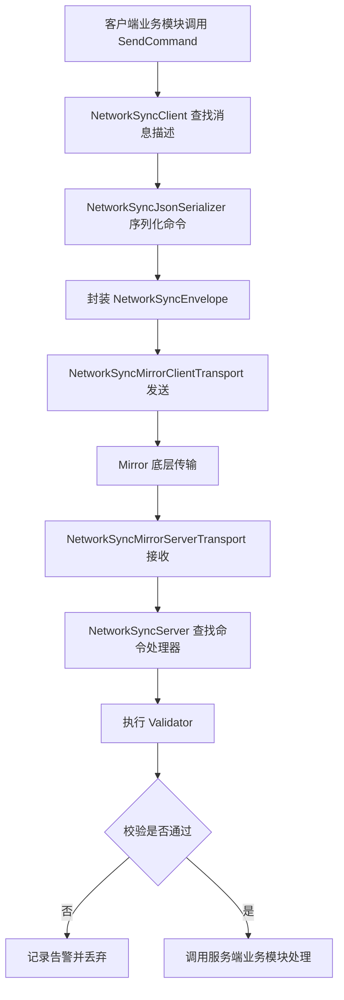
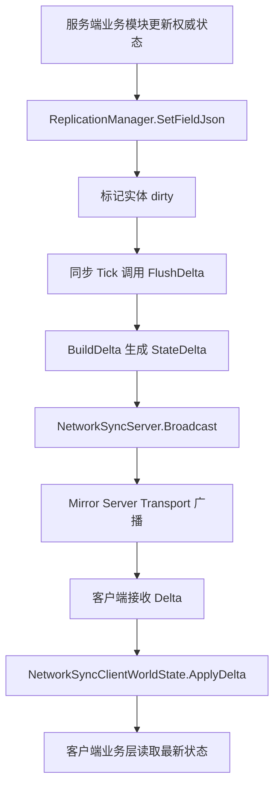
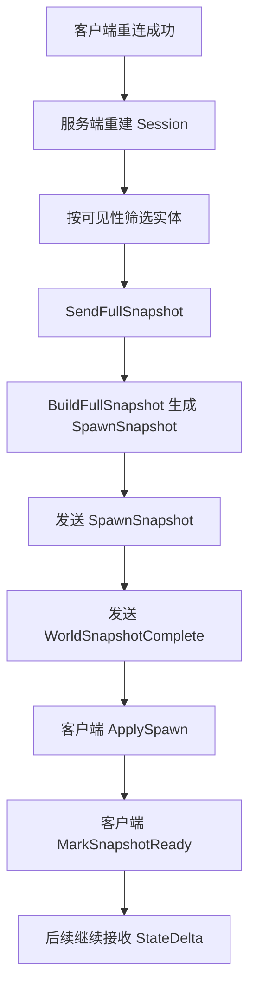

# NetworkSync 网络同步框架开发文档

## 1. 文档概述

本文档描述 `ShanHaiFantasy` 项目中 `NetworkSync` 模块的设计目标、代码结构与使用方式。

模块目录：

- `Assets/Script/GamePlay/NetworkSync/NetworkSyncEnums.cs`
- `Assets/Script/GamePlay/NetworkSync/NetworkSyncInterfaces.cs`
- `Assets/Script/GamePlay/NetworkSync/NetworkSyncEnvelope.cs`
- `Assets/Script/GamePlay/NetworkSync/NetworkSyncJsonSerializer.cs`
- `Assets/Script/GamePlay/NetworkSync/NetworkSyncRegistry.cs`
- `Assets/Script/GamePlay/NetworkSync/NetworkSyncReplication.cs`
- `Assets/Script/GamePlay/NetworkSync/NetworkSyncClient.cs`
- `Assets/Script/GamePlay/NetworkSync/NetworkSyncServer.cs`
- `Assets/Script/GamePlay/NetworkSync/NetworkSyncMirrorTransport.cs`

模块目标：

- 将 Mirror 严格收口为底层传输插件
- 明确客户端与服务端职责边界
- 禁止业务层直接使用 `SyncVar`、`SyncList`、`NetworkTransform`、`Command`、`Rpc`、`TargetRpc`
- 使用 `Command / Event / Snapshot / Delta` 四类消息表达网络行为
- 使用 `ReplicationManager` 负责状态同步与断线重连恢复
- 不做二次分包，消息可靠性与分片重组交给 Mirror

当前落地范围：

- 核心消息枚举与协议契约
- 客户端与服务端路由骨架
- Mirror 自定义消息传输适配层
- 状态复制骨架与客户端本地状态缓存
- 文档化的扩展入口，便于后续接入代码生成器

---

## 2. 类图

```mermaid
classDiagram
    class NetworkSyncClient {
        -INetworkSyncClientTransport transport
        -INetworkSyncSerializer serializer
        -NetworkSyncRegistry registry
        -Dictionary~int, ClientHandlerEntry~ handlers
        -NetworkSyncClientWorldState worldState
        +RegisterModule(INetworkSyncClientModule module)
        +RegisterHandler~TMessage~(NetworkSyncMessageDescriptor descriptor, Action handler)
        +SendCommand~TMessage~(TMessage message, int worldId)
    }

    class NetworkSyncServer {
        -INetworkSyncServerTransport transport
        -INetworkSyncSerializer serializer
        -NetworkSyncRegistry registry
        -Dictionary~int, ServerHandlerEntry~ handlers
        -Dictionary~int, NetworkSyncSession~ sessions
        -NetworkSyncReplicationManager replication
        +RegisterModule(INetworkSyncServerModule module)
        +RegisterCommand~TMessage~(NetworkSyncMessageDescriptor descriptor, Action handler, Func validator)
        +SendTo(NetworkSyncConnectionRef connection, INetworkSyncMessage message, int worldId)
        +Broadcast(INetworkSyncMessage message, int worldId, Predicate filter)
        +SendFullSnapshot(NetworkSyncConnectionRef connection, int worldId, Predicate filter)
        +FlushDelta(int worldId, Predicate connectionFilter, Predicate stateFilter)
    }

    class NetworkSyncRegistry {
        -Dictionary~int, NetworkSyncMessageDescriptor~ descriptorsById
        -Dictionary~Type, NetworkSyncMessageDescriptor~ descriptorsByType
        +Register(NetworkSyncMessageDescriptor descriptor)
        +TryGetById(int messageId, out descriptor)
        +GetByType(Type messageType)
    }

    class NetworkSyncReplicationManager {
        -Dictionary~int, NetworkSyncReplicatedEntityState~ entities
        -HashSet~int~ dirtyEntityIds
        +UpsertEntity(int entityId, string entityType, int ownerConnectionId)
        +SetFieldJson(int entityId, string entityType, string fieldId, string payloadJson, NetworkSyncDelivery delivery, int ownerConnectionId, int sortOrder)
        +BuildFullSnapshot(Predicate filter)
        +BuildDelta(Predicate filter)
        +CreateDespawnMessage(params int[] entityIds)
        +ClearDirty()
    }

    class NetworkSyncClientWorldState {
        -Dictionary~int, NetworkSyncReplicatedEntityState~ entities
        +IsSnapshotReady bool
        +ApplySpawn(NetworkSyncSpawnSnapshotMessage message)
        +ApplyDelta(NetworkSyncStateDeltaMessage message)
        +ApplyDespawn(NetworkSyncDespawnMessage message)
        +MarkSnapshotReady(int snapshotVersion)
    }

    class NetworkSyncMirrorClientTransport {
        +Bind()
        +Unbind()
        +Send(NetworkSyncEnvelope envelope, NetworkSyncDelivery delivery)
    }

    class NetworkSyncMirrorServerTransport {
        +Bind()
        +Unbind()
        +Send(NetworkSyncConnectionRef connection, NetworkSyncEnvelope envelope, NetworkSyncDelivery delivery)
        +Broadcast(NetworkSyncEnvelope envelope, NetworkSyncDelivery delivery, Predicate filter)
    }

    NetworkSyncClient --> NetworkSyncRegistry : 使用
    NetworkSyncServer --> NetworkSyncRegistry : 使用
    NetworkSyncServer --> NetworkSyncReplicationManager : 管理状态复制
    NetworkSyncClient --> NetworkSyncClientWorldState : 应用快照与增量
    NetworkSyncClient --> NetworkSyncMirrorClientTransport : 默认推荐传输
    NetworkSyncServer --> NetworkSyncMirrorServerTransport : 默认推荐传输
```



类职责说明：

- `NetworkSyncClient`
  客户端唯一网络入口，只允许发送 `Command`，并负责接收服务端的 `Event / Snapshot / Delta`。
- `NetworkSyncServer`
  服务端唯一网络入口，只处理客户端 `Command`，并负责校验、路由、状态同步和断线重连恢复。
- `NetworkSyncRegistry`
  保存消息描述信息，统一维护 `MessageId` 与消息类型之间的映射。
- `NetworkSyncReplicationManager`
  保存服务端权威状态，负责脏标记、全量快照和增量快照生成。
- `NetworkSyncClientWorldState`
  客户端本地世界状态缓存，用于应用 `SpawnSnapshot`、`StateDelta`、`Despawn` 和重连恢复。
- `NetworkSyncMirrorClientTransport / NetworkSyncMirrorServerTransport`
  Mirror 适配层，负责注册底层自定义消息、发送消息和接收消息。

---

## 3. 核心接口说明

### 3.1 核心枚举

| 枚举 | 说明 |
| --- | --- |
| `NetworkSyncMessageKind` | 消息类型，包含 `Command`、`Event`、`Snapshot`、`Delta` |
| `NetworkSyncDirection` | 消息方向，区分 `ClientToServer` 与 `ServerToClient` |
| `NetworkSyncDelivery` | 传输可靠性，目前包含 `Reliable` 与 `Unreliable` |
| `NetworkSyncTarget` | 服务端发送目标，包含 `Owner`、`Broadcast`、`Observers` 等 |
| `NetworkSyncAuthority` | 权限策略，包含 `AnyClient`、`OwnerOnly`、`HostOnly`、`ServerOnly` |
| `NetworkSyncProtocolType` | 协议调用语义，显式标记 `Cmd / Rpc / TargetRpc / Snapshot / Delta` |

### 3.2 NetworkSyncClient

| 接口 | 参数 | 返回值 | 功能说明 | 使用限制 |
| --- | --- | --- | --- | --- |
| `RegisterModule(INetworkSyncClientModule module)` | `module`：客户端模块 | 无 | 注册客户端业务模块并注入网络入口 | 模块内部只能注册 `ServerToClient` 消息处理 |
| `RegisterRpc<TMessage>(NetworkSyncMessageDescriptor descriptor, Action<NetworkSyncClientContext, TMessage> handler)` | `descriptor`：协议描述；`handler`：处理回调 | 无 | 注册客户端 `Rpc` 处理函数 | `TMessage` 必须实现 `INetworkSyncRpc` |
| `RegisterTargetRpc<TMessage>(NetworkSyncMessageDescriptor descriptor, Action<NetworkSyncClientContext, TMessage> handler)` | `descriptor`：协议描述；`handler`：处理回调 | 无 | 注册客户端 `TargetRpc` 处理函数 | `TMessage` 必须实现 `INetworkSyncTargetRpc` |
| `RegisterSnapshot<TMessage>(NetworkSyncMessageDescriptor descriptor, Action<NetworkSyncClientContext, TMessage> handler)` | `descriptor`：协议描述；`handler`：处理回调 | 无 | 注册客户端完整快照处理函数 | `TMessage` 必须实现 `INetworkSyncSnapshot` |
| `RegisterDelta<TMessage>(NetworkSyncMessageDescriptor descriptor, Action<NetworkSyncClientContext, TMessage> handler)` | `descriptor`：协议描述；`handler`：处理回调 | 无 | 注册客户端增量状态处理函数 | `TMessage` 必须实现 `INetworkSyncDelta` |
| `SendCmd<TMessage>(TMessage message, int worldId = 0)` | `message`：命令对象；`worldId`：逻辑世界 ID | 无 | 发送客户端 `Cmd` 到服务端 | `TMessage` 必须实现 `INetworkSyncCmd` |

### 3.3 NetworkSyncServer

| 接口 | 参数 | 返回值 | 功能说明 | 使用限制 |
| --- | --- | --- | --- | --- |
| `RegisterModule(INetworkSyncServerModule module)` | `module`：服务端模块 | 无 | 注册服务端业务模块 | 模块只应注册 `Cmd` 处理 |
| `RegisterCmd<TMessage>(NetworkSyncMessageDescriptor descriptor, Action<NetworkSyncServerContext, TMessage> handler, Func<NetworkSyncServerContext, TMessage, NetworkSyncValidationResult> validator = null)` | `descriptor`、`handler`、`validator` | 无 | 注册 `Cmd` 处理器与可选校验器 | `TMessage` 必须实现 `INetworkSyncCmd` |
| `Rpc(INetworkSyncRpc message, int worldId = 0, Predicate<NetworkSyncConnectionRef> filter = null)` | 消息、世界 ID、过滤器 | 无 | 服务端广播 `Rpc` 到多个连接 | 用于群体事件与公共表现 |
| `TargetRpc(NetworkSyncConnectionRef connection, INetworkSyncTargetRpc message, int worldId = 0)` | 连接、消息、世界 ID | 无 | 服务端向单一连接发送 `TargetRpc` | 用于定向反馈或个人数据 |
| `SendFullSnapshot(NetworkSyncConnectionRef connection, int worldId = 0, Predicate<NetworkSyncReplicatedEntityState> filter = null)` | 连接、世界 ID、实体过滤器 | 无 | 发送完整快照并追加 `WorldSnapshotComplete` | 用于首次进入和断线重连恢复 |
| `FlushDelta(int worldId = 0, Predicate<NetworkSyncConnectionRef> connectionFilter = null, Predicate<NetworkSyncReplicatedEntityState> stateFilter = null)` | 世界 ID、连接过滤器、状态过滤器 | 无 | 将当前脏状态生成 `StateDelta` 并广播 | 适合在同步 tick 中调用 |

### 3.4 NetworkSyncReplicationManager

| 接口 | 参数 | 返回值 | 功能说明 | 使用限制 |
| --- | --- | --- | --- | --- |
| `UpsertEntity(int entityId, string entityType, int ownerConnectionId)` | 实体 ID、实体类型、所属连接 | 无 | 创建或更新权威实体壳体 | 实体 ID 必须稳定唯一 |
| `SetFieldJson(int entityId, string entityType, string fieldId, string payloadJson, NetworkSyncDelivery delivery, int ownerConnectionId = -1, int sortOrder = 0)` | 实体 ID、字段 ID、字段 JSON、可靠性等 | 无 | 更新字段并标记实体 dirty | 建议字段值通过上层状态对象序列化为 JSON |
| `BuildFullSnapshot(Predicate<NetworkSyncReplicatedEntityState> filter = null)` | 实体过滤器 | `NetworkSyncSpawnSnapshotMessage` | 生成完整实体快照 | 一般用于首次进入、重连恢复 |
| `BuildDelta(Predicate<NetworkSyncReplicatedEntityState> filter = null)` | 实体过滤器 | `NetworkSyncStateDeltaMessage` | 生成当前脏实体增量 | 不会自动清空 dirty 标记 |
| `CreateDespawnMessage(params int[] entityIds)` | 实体 ID 列表 | `NetworkSyncDespawnMessage` | 创建实体销毁消息 | 发送后应同步删除服务端状态 |
| `ClearDirty()` | 无 | 无 | 清空当前脏实体集合 | 通常在成功发送 `StateDelta` 后调用 |

### 3.5 Mirror 传输层接口

| 接口 | 参数 | 返回值 | 功能说明 | 使用限制 |
| --- | --- | --- | --- | --- |
| `NetworkSyncMirrorClientTransport.Bind()` | 无 | 无 | 在客户端注册 Mirror 消息处理器 | 同一实例避免重复绑定 |
| `NetworkSyncMirrorClientTransport.Send(NetworkSyncEnvelope envelope, NetworkSyncDelivery delivery)` | Envelope、可靠性 | 无 | 通过 Mirror Client 发送消息 | 客户端必须已激活 |
| `NetworkSyncMirrorServerTransport.Bind()` | 无 | 无 | 在服务端注册 Mirror 消息处理器 | 同一实例避免重复绑定 |
| `NetworkSyncMirrorServerTransport.Send(NetworkSyncConnectionRef connection, NetworkSyncEnvelope envelope, NetworkSyncDelivery delivery)` | 连接、Envelope、可靠性 | 无 | 向单一客户端发送消息 | 连接必须为 `ready` 状态 |
| `NetworkSyncMirrorServerTransport.Broadcast(NetworkSyncEnvelope envelope, NetworkSyncDelivery delivery, Predicate<NetworkSyncConnectionRef> filter)` | Envelope、可靠性、过滤器 | 无 | 向多个客户端广播消息 | 过滤器可控制可见性或世界隔离 |

---

## 4. 功能与数据流程图

### 4.1 客户端命令上行流程



### 4.2 状态同步与增量下发流程



### 4.3 断线重连恢复流程



---

## 5. 调用示例

### 5.1 定义命令消息

```csharp
using System;

[Serializable]
public sealed class SetTimeScaleCommand : INetworkSyncCmd {
    public float timeScale;
}
```

### 5.2 服务端注册命令处理

```csharp
public sealed class TestToolServerModule : INetworkSyncServerModule {
    public void Register(NetworkSyncServer server) {
        server.RegisterCmd(
            NetworkSyncMessageDescriptor.Create<SetTimeScaleCommand>(
                1001,
                "TestTool",
                NetworkSyncMessageKind.Command,
                NetworkSyncProtocolType.Cmd,
                NetworkSyncDirection.ClientToServer,
                NetworkSyncDelivery.Reliable,
                NetworkSyncTarget.None,
                NetworkSyncAuthority.HostOnly,
                "TestTool.SetTimeScale"),
            (context, message) => {
                context.Replication.SetFieldJson(
                    1,
                    "WorldState",
                    "timeScale",
                    "{\"value\":" + message.timeScale + "}",
                    NetworkSyncDelivery.Reliable);

                context.Network.FlushDelta(context.CurrentWorldId);
            },
            (context, message) => {
                if (message.timeScale <= 0f) {
                    return NetworkSyncValidationResult.Fail("INVALID_TIME_SCALE", "timeScale 必须大于 0");
                }
                return NetworkSyncValidationResult.Ok();
            });
    }
}
```

### 5.3 客户端发送命令

```csharp
NetworkSyncClient client = new NetworkSyncClient(new NetworkSyncMirrorClientTransport());
client.SendCommand(new SetTimeScaleCommand {
    timeScale = 0.5f
}, worldId: 1);
```

### 5.4 客户端读取同步状态

```csharp
if (client.WorldState.TryGetEntity(1, out NetworkSyncReplicatedEntityState entityState)) {
    for (int i = 0; i < entityState.fields.Count; i++) {
        NetworkSyncReplicatedFieldState field = entityState.fields[i];
        if (field.fieldId == "timeScale") {
            UnityEngine.Debug.Log("当前 TimeScale 状态: " + field.payloadJson);
        }
    }
}
```

### 5.5 服务端发送完整快照

```csharp
server.SendFullSnapshot(connectionRef, worldId: 1, filter: (entity) => {
    return entity.ownerConnectionId == -1 || entity.ownerConnectionId == connectionRef.ConnectionId;
});
```

---

## 6. 异常处理说明

| 异常类型 | 触发条件 | 表现形式 | 处理方式 |
| --- | --- | --- | --- |
| `ArgumentNullException` | 传输层、序列化器、消息描述为空 | 运行时抛出异常 | 初始化 `NetworkSyncClient/Server` 时必须注入有效依赖 |
| `InvalidOperationException` | 同一 `MessageId` 被不同消息类型重复注册 | 注册阶段抛出异常 | 统一维护消息 ID 分配表 |
| `InvalidOperationException` | 客户端尝试发送非 `Command` 消息 | 发送阶段抛出异常 | 业务层只通过 `SendCommand` 发送上行消息 |
| 反序列化失败 | 收到未知消息或 JSON 结构与类型不匹配 | 输出 Unity 错误日志 | 检查消息定义、版本兼容和注册表一致性 |
| 校验失败 | 命令数据非法、权限不满足 | 输出告警日志，消息被丢弃 | 通过 `Validator` 返回明确的错误码与错误信息 |

失败处理策略：

- Mirror 传输层不做业务纠正，只负责收发和日志。
- 服务端收到非法命令时直接拒绝处理，不进入业务逻辑。
- 客户端收到未知消息时只记日志，不尝试猜测修复。
- 状态恢复以完整快照为准，不依赖历史事件回放。

---

## 7. 与 AI 内容或其他模块集成说明

### 7.1 Key/ID 与协议管理

建议统一维护网络协议 ID 表：

```text
1 ~ 99      保留给框架内建消息
100 ~ 999   公共系统消息
1000 以上   业务模块协议
```

建议协议命名规则：

- `XxxCommand`
- `XxxEvent`
- `XxxSnapshot`
- `XxxDelta`

好处：

- 便于 AI 生成协议时保持统一命名和方向语义
- 便于后续自动代码生成器读取描述信息
- 便于版本比对与回滚

### 7.2 与 AI 生成内容工作流的关系

AI 后续可以基于本模块生成：

- 协议定义草案
- 客户端 Facade
- 服务端 Handler Base
- 状态字段映射表
- 校验器模板

推荐 AI 产物输入包括：

- 模块名
- 协议方向
- 权限策略
- 可靠性要求
- 状态字段列表

### 7.3 与其他模块集成方式

- 游戏逻辑模块
  通过 `INetworkSyncServerModule / INetworkSyncClientModule` 注册消息处理
- 状态模块
  通过 `ReplicationManager` 维护权威状态
- 场景管理模块
  可使用 `worldId` 做多世界隔离
- 内容系统
  可通过 `entityType + fieldId` 将 AI 配置、角色状态、关卡状态映射进复制系统

---

## 8. 目录与资源映射说明

### 8.1 模块代码目录

当前模块代码位于：

- `Assets/Script/GamePlay/NetworkSync/`

### 8.2 推荐后续扩展目录

在不新增顶层目录的前提下，建议后续继续沿 `NetworkSync` 模块内组织：

| 类型 | 建议文件名或逻辑分组 |
| --- | --- |
| 核心枚举与接口 | `NetworkSyncEnums.cs`、`NetworkSyncInterfaces.cs` |
| Envelope 与序列化 | `NetworkSyncEnvelope.cs`、`NetworkSyncJsonSerializer.cs` |
| 路由与注册 | `NetworkSyncRegistry.cs` |
| 状态复制 | `NetworkSyncReplication.cs` |
| 客户端入口 | `NetworkSyncClient.cs` |
| 服务端入口 | `NetworkSyncServer.cs` |
| Mirror 适配器 | `NetworkSyncMirrorTransport.cs` |
| 文档 | `NetworkSync_开发文档.md` |

### 8.3 资源与运行时映射

| 运行时概念 | 对应模块 |
| --- | --- |
| 传输层 | Mirror |
| 消息协议 | `INetworkSyncMessage` 系列 |
| 权威状态 | `NetworkSyncReplicationManager` |
| 客户端本地状态 | `NetworkSyncClientWorldState` |
| 单连接上下文 | `NetworkSyncConnectionRef` 与 `NetworkSyncSession` |
| 世界隔离 | `worldId` |

---

## 9. 内存管理与缓存策略

### 9.1 当前策略

- `NetworkSyncRegistry`
  缓存消息描述信息，避免重复反射或重复注册
- `NetworkSyncReplicationManager`
  缓存服务端权威实体状态
- `NetworkSyncClientWorldState`
  缓存客户端当前可见状态
- `NetworkSyncMirrorServerTransport`
  缓存连接引用，避免重复包装

### 9.2 策略说明

- 当前序列化层使用 `JsonUtility + UTF8 byte[]`
  适合做第一版可读性高的协议骨架
- 若后续高频同步压测发现瓶颈，可替换为：
  - 二进制序列化
  - 字段级 bitmask 编码
  - 对象池化

### 9.3 最佳实践

- 高频状态不要频繁全量快照，优先走 `Delta`
- 低频且关键的状态可以周期性补发可靠快照
- 大型世界建议结合兴趣管理或可见性过滤器裁剪同步对象
- 避免把一次性表现事件混进状态快照

---

## 10. 线程安全说明

当前框架默认按 Unity 主线程网络驱动方式设计：

- Mirror Handler 回调在主线程中处理
- 客户端状态缓存和服务端复制管理器默认由主线程更新

注意事项：

- 不要在消息处理回调中执行阻塞式长耗时逻辑
- 若后续需要多线程序列化或后台快照构建，需额外为：
  - `NetworkSyncRegistry`
  - `NetworkSyncReplicationManager`
  - `NetworkSyncClientWorldState`
  增加锁或无锁数据结构保护
- 当前版本没有引入后台线程，因此优先保证可读性和边界清晰

---

## 11. 注意事项与最佳实践

### 11.1 使用注意事项

- 业务层只发送 `Command`，不要在客户端直接发送 `Event / Snapshot / Delta`
- 业务层禁止直接访问 Mirror 连接对象
- 不要把状态同步写成 `Rpc` 连续广播
- 新实体加入世界时必须先 `UpsertEntity`
- 断线重连恢复必须走 `SendFullSnapshot`

### 11.2 最佳实践

- 把一次性行为和长期状态严格分开
- 所有 `MessageId` 统一登记，避免碰撞
- 所有状态字段使用稳定 `fieldId`
- `Validator` 只做权限和输入合法性检查，不掺杂 UI 或表现逻辑
- 后续代码生成层只负责生成协议样板，不负责硬编码业务特判

---

## 12. 扩展与维护建议

### 12.1 下一步可扩展方向

- 增加二进制序列化器，替换 JSON 以提升性能
- 增加代码生成器，自动生成：
  - 消息类
  - 客户端 Facade
  - 服务端 Handler Base
  - 状态字段描述
- 增加 Interest Management 过滤层
- 增加 Tick 驱动的发送调度器
- 增加本地预测、回滚与服务器纠正扩展点

### 12.2 与 Mirror 的长期关系

建议长期坚持：

- Mirror 只做传输和对象生命周期
- 不允许业务层直接写 Mirror 特性
- 即使将来替换为其他网络库，也只替换 `Transport Adapter`

### 12.3 维护建议

- 每个网络模块都应保留一份协议清单与字段说明
- 每次新增状态字段时同步更新 `fieldId` 规范
- 每次新增模块时同步补充注册表与开发文档

---

## 13. 文档结论

当前 `NetworkSync` 模块已经完成以下基础落地：

- 明确的消息模型与方向约束
- Client/Server 双入口骨架
- Mirror 底层传输适配
- 服务端权威状态复制骨架
- 客户端快照与增量应用骨架
- 断线重连恢复模型

这套框架可以作为 `ShanHaiFantasy` 后续网络功能的统一基础设施。  
后续业务模块只需要围绕：

- 消息定义
- 服务端命令处理
- 客户端事件处理
- 状态字段复制

进行扩展，而不再直接依赖 Mirror 特性本身。

---

## 14. 测试案例：角色开火同步

当前模块已经补充一套最小示例，用来演示“本地玩家发起开火命令，服务端更新权威状态，其他玩家收到开火事件”的完整链路。

示例文件：

- `Assets/Script/GamePlay/NetworkSync/NetworkSyncRoleFireMessages.cs`
- `Assets/Script/GamePlay/NetworkSync/NetworkSyncRoleFireModules.cs`
- `Assets/Script/GamePlay/NetworkSync/NetworkSyncRoleFireLocalDemo.cs`

### 14.1 案例目标

- 本地玩家通过 `NetworkSyncRoleFireCmd` 向服务端发送开火意图
- 服务端校验角色归属、子弹数量、发射序列号与方向合法性
- 服务端扣减弹药，并将 `Ammo / LastFireSequence / LastFirePosition / LastFireDirection` 写入 `ReplicationManager`
- 服务端向其他连接广播 `NetworkSyncRoleFireRpc`
- 其他客户端收到事件后触发表现层逻辑
- 任意客户端都可以通过 `WorldState` 读取该角色当前同步状态

### 14.2 代码入口

客户端开火入口：

```csharp
localClientModule.SendRoleFireCmd(
    localRoleEntityId,
    nextFireSequence,
    muzzleWorldPosition,
    transform.forward,
    worldId);
```

服务端处理入口：

```csharp
server.RegisterCmd<NetworkSyncRoleFireCmd>(
    NetworkSyncRoleFireProtocols.RoleFireCmd,
    HandleRoleFireCmd,
    ValidateRoleFireCmd);
```

服务端状态写入：

```csharp
server.Replication.SetFieldJson(
    roleState.RoleEntityId,
    "Role",
    NetworkSyncRoleFireFieldIds.AMMO,
    JsonUtility.ToJson(new NetworkSyncIntValue { value = roleState.Ammo }),
    NetworkSyncDelivery.Reliable,
    roleState.ConnectionId,
    10);
```

### 14.3 本地演示方法

将 `NetworkSyncRoleFireLocalDemo` 挂到任意场景对象后，可以直接用组件右键菜单触发：

- `Setup Role Fire Demo`
- `Run Role Fire Demo Once`

该案例不会依赖真实 Mirror 联机，而是通过 `NetworkSyncLocalLoopbackHub` 在本地模拟两个客户端与一个服务端，主要用于验证：

- 消息注册是否完整
- 命令校验链路是否生效
- 服务端广播是否只发给其他玩家
- 状态同步是否进入 `ReplicationManager`
- 客户端 `WorldState` 是否能正确读取最新弹药数

### 14.4 预期结果

- 本地客户端发出一次开火后，服务端将本地角色弹药数减一
- 远端客户端收到一条 `RoleFireRpc`
- 本地客户端与远端客户端读取到的该角色 `Ammo` 保持一致
- 如果连续发送相同 `fireSequence` 或者弹药不足，服务端校验会拒绝处理
